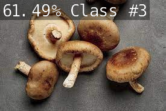

# Mushroom Classification Using Jetson Nano

In this project I created a simple mushroom recognition program. This can be used to test one
jpg image one at a time or could be used with a live input from a jetson nano from a camera 
to classify what kind of mushroom is it. This is a small dataset with only about 10 images
for each mushroom catagory. There are 5 differnt mushroom catagories: lionsmane, oyster, 
porcini, shitake, and truffle. The futuer application of this program could be to help see
if a mushroom is edible or not and/or train it with more classes/types of mushrooms. 

## Data
Searched on Google Images for the 5 classs of mushrooms and downloaded them to data directory
in the format required by PyTorch to train on them. These images are the property of the
sites they were downloaded from.

The categories are defined in `data/mushrooms/labels.text`.

## Training 
Used the classification example and script from the class to train on this data.
With the default settings I had a hard time to train such that the acuracy was close to 80
and tried a few things (different model architecture, most of them very slow and some 
failed to run, tried different batch size but it did not help) and in the end tried
to change the learning rate (go slower) and increased the number of training epochs
which helped me get to >80 accuracy.

`train.py --model-dir=models/mushrooms --lr=0.01 --epochs=500 data/mushrooms/`

``` bash
=> Epoch 105
  * Train Loss     7.8726e-01
  * Train Accuracy 70.8333
  * Val Loss       5.1596e-01
  * Val Accuracy   84.9057*
saved best model to:  models/mushrooms2/model_best.pth.tar
```

## Export Model
Used the example script from the class to convert the resnet18 model to ONNX format
that is required by NVidia tool set.

`python3 onnx_export.py --model-dir=models/mushrooms`

## Evaluate on a Sample
To try classify one file used `imagenet`

`imagenet --model=models/mushrooms/resnet18.onnx --input_blob=input_0 --output_blob=output_0 --labels=data/mushrooms/labels.txt data/mushrooms/test/shitake/01.jpeg data/mushrooms/test.jpeg`

If you have direct access to the Jetson device you can use `imagenet` to predict on the video 
from the camera and show the camera different mushrooms.

Here is an example:

.

This correctly identifies the mushrooms in the image as shitake mushrooms. 

## Scripts
The scripts used here `train.py`, `reshape.py`, `onnx_export.py` and `onnx_validate.py` where taken
from the original class project at [`https://github.com/dusty-nv/jetson-inference/`](https://github.com/dusty-nv/jetson-inference/).